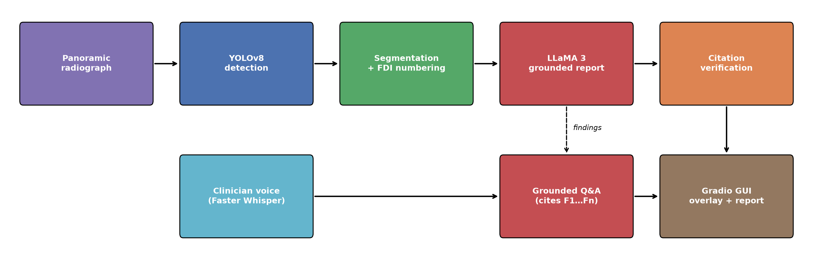

# Dental Radiograph Pipeline

End-to-end analysis of panoramic dental radiographs: **YOLOv8 detection → segmentation and FDI tooth numbering →
grounded report generation with LLaMA 3**, plus **voice interaction** (Faster Whisper) and a **GUI** (Gradio).



## Features
- **Detection / segmentation**: YOLOv8 (detect or `-seg`) for caries, deep caries, periapical lesions, impacted
  teeth, restorations and tooth numbers.
- **FDI numbering**: findings are attached to detected tooth boxes, or placed by position on the OPG
  (image-left = patient's right).
- **Grounded reports**: LLaMA 3 sees only the numbered detections and must cite `[F#]` in every sentence;
  uncited or invented statements are flagged for the clinician.
- **Voice Q&A**: ask "Is there caries on tooth 36?" by microphone; Faster Whisper transcribes and the answer is
  grounded in the same detections.
- **GUI**: upload, view the annotated image and the report, and ask questions in one Gradio app.

## Repository Structure
```
Dental-Radiograph-Pipeline/
├── Code/
│   ├── dental/
│   │   ├── detect.py      # YOLOv8 detection / segmentation → findings
│   │   ├── teeth.py       # FDI tooth assignment
│   │   ├── report.py      # LLaMA 3 grounded report + Q&A, citation verification
│   │   ├── voice.py       # Faster Whisper speech-to-text, optional TTS
│   │   ├── overlay.py     # annotated image
│   │   └── findings.py    # Finding data class, label groups
│   ├── app.py             # Gradio GUI
│   ├── run.py             # batch CLI
│   ├── plot_pipeline.py   # renders Figures/pipeline.png
│   ├── tests/             # FDI numbering and grounding tests
│   ├── weights/           # trained YOLOv8 weights go here
│   └── requirements.txt
├── Dataset/               # DENTEX / Tufts download and YOLO layout
├── Figures/               # pipeline diagram
├── Results/               # generated reports and annotated images
├── LICENSE
└── README.md
```

## Quick Start
```bash
cd Code
pip install -r requirements.txt
python -m pytest tests                                     # no weights needed
ollama pull llama3
python app.py --weights weights/dental_yolov8.pt           # GUI with voice
python run.py --weights weights/dental_yolov8.pt --images ../Dataset/dentex/images/val/*.png
```

> Research software, not a medical device. Outputs must be reviewed by a qualified dentist.

## Author
**Wajiha Rahim Khan**  
[Google Scholar](https://scholar.google.com/citations?user=ctvOkbYAAAAJ) · [Email](mailto:wajihakhan906@gmail.com)

## License
MIT. See [LICENSE](LICENSE).
